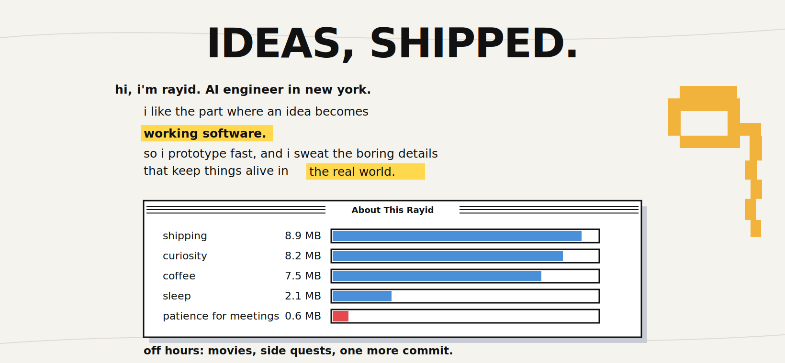
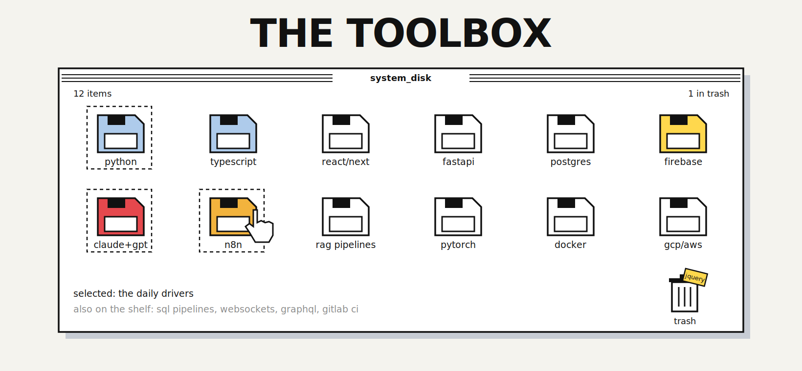
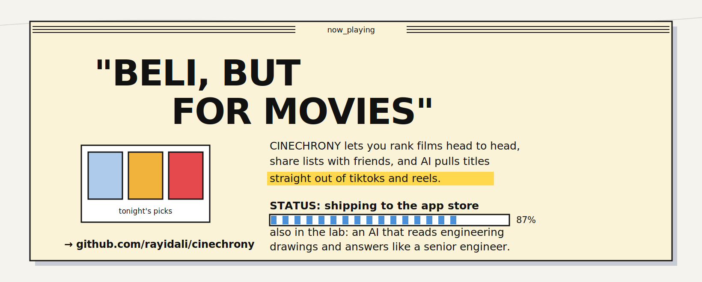
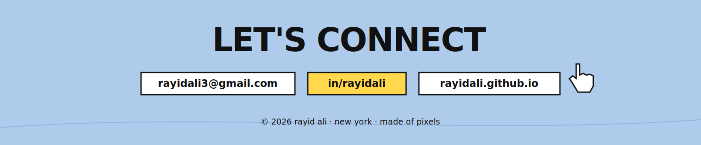

<!-- ═══════════════════ BANNER ═══════════════════ -->

<!-- ═══════════════════ GIF STRIP 1 ═══════════════════ -->

<!-- ═══════════════════ SOCIAL BAR ═══════════════════ -->
 

&nbsp;
&nbsp;
&nbsp;

  

<!-- ═══════════════════ DIVIDER ═══════════════════ -->

 

<!-- ═══════════════════ ABOUT ME TERMINAL ═══════════════════ -->

  

<!-- ═══════════════════ GIF STRIP 2 ═══════════════════ -->

  

<!-- ═══════════════════ DIVIDER ═══════════════════ -->

 

<!-- ═══════════════════ TECH STACK ═══════════════════ -->

  

<!-- ═══════════════════ DIVIDER ═══════════════════ -->

 

<!-- ═══════════════════ CURRENTLY BUILDING ═══════════════════ -->

  

<!-- ═══════════════════ OTHER PROJECTS ═══════════════════ -->

&nbsp;&nbsp;

  

<!-- ═══════════════════ DIVIDER ═══════════════════ -->

 

<!-- ═══════════════════ STATS ═══════════════════ -->

&nbsp;&nbsp;

  

  

<!-- ═══════════════════ DIVIDER ═══════════════════ -->

 

<!-- ═══════════════════ FOOTER ═══════════════════ -->

  

