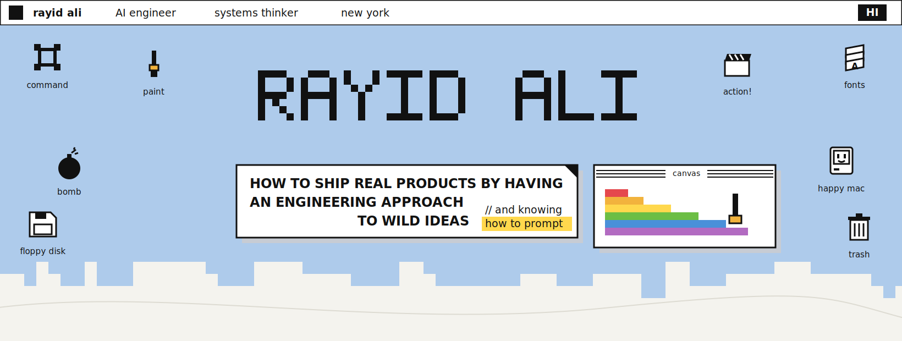
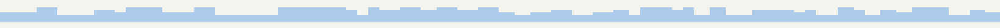
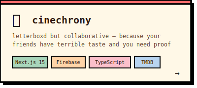
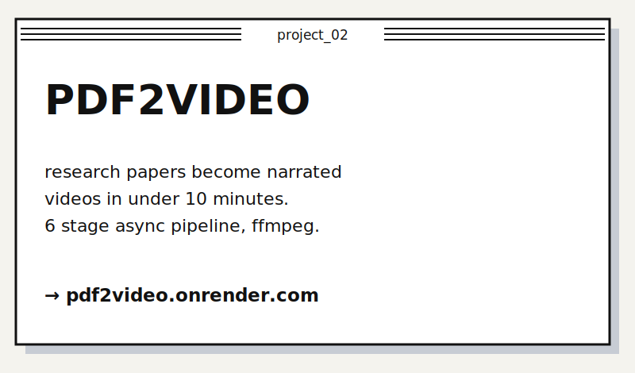
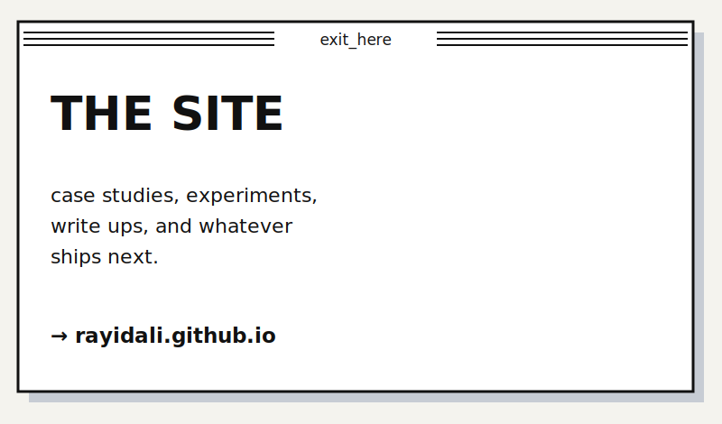

<div align="center">

<!-- ANIMATED GHIBLI BANNER -->


<br/>

<!-- SOCIAL LINKS — clean, minimal -->
<a href="https://linkedin.com/in/rayidali"></a>&nbsp;
<a href="mailto:rayidali3@gmail.com"></a>&nbsp;
<a href="https://rayidali.github.io"></a>

<br/><br/>

<!-- GIF 1 — header accent -->


</div>

---

<div align="center">

## `> whoami`

</div>

<p align="center">
<em>
i'm rayid; i like building things that live somewhere between "actually useful" and "questionable life choices."
<br/>currently knee-deep in AI/ML, making LLMs do things they probably shouldn't
<br/><br/>
i ship fast, break things occasionally, and fix them before anyone notices.
<br/>MS in Computer Science. data analytics & AI obsessive. full-stack when i have to be.
<br/><br/>
☕ fun fact: coffee makes me sleepy, which probably means i got adhd
</em>
</p>

<br/>

<div align="center">

<!-- DIVIDER -->


<br/><br/>

<!-- GIF 2 — section divider -->


<br/><br/>

## `> cat tech_stack.md`

</div>

<br/>

<table align="center">
<tr>
<td align="center" width="300">

### ⚔️ Languages

<br/>


</td>
<td align="center" width="300">

### 🧠 AI / ML

<br/>


</td>
<td align="center" width="300">

### ☁️ Cloud & Tools

<br/>


</td>
</tr>
</table>

<br/>

<div align="center">

<!-- DIVIDER -->


<br/><br/>

## `> ls projects/`

<br/>

<!-- PROJECT CARDS -->
<a href="https://github.com/rayidali/cinechrony">
  
</a>

<br/><br/>

<a href="https://github.com/rayidali/pdf2video">
  
</a>

<br/><br/>

<a href="https://github.com/rayidali/rayidali.github.io">
  
</a>

<br/><br/>

<!-- DIVIDER -->


<br/><br/>

## `> git log --stat`

<br/>


<br/><br/>


<br/><br/>


<br/><br/>

<!-- DIVIDER -->


<br/><br/>

```
 ╔═══════════════════════════════════════════════╗
 ║                                               ║
 ║   thanks for scrolling this far.              ║
 ║   let's build something cool together.        ║
 ║                                               ║
 ║   rayidali3@gmail.com                         ║
 ║                                               ║
 ╚═══════════════════════════════════════════════╝
```

<br/>


</div>
